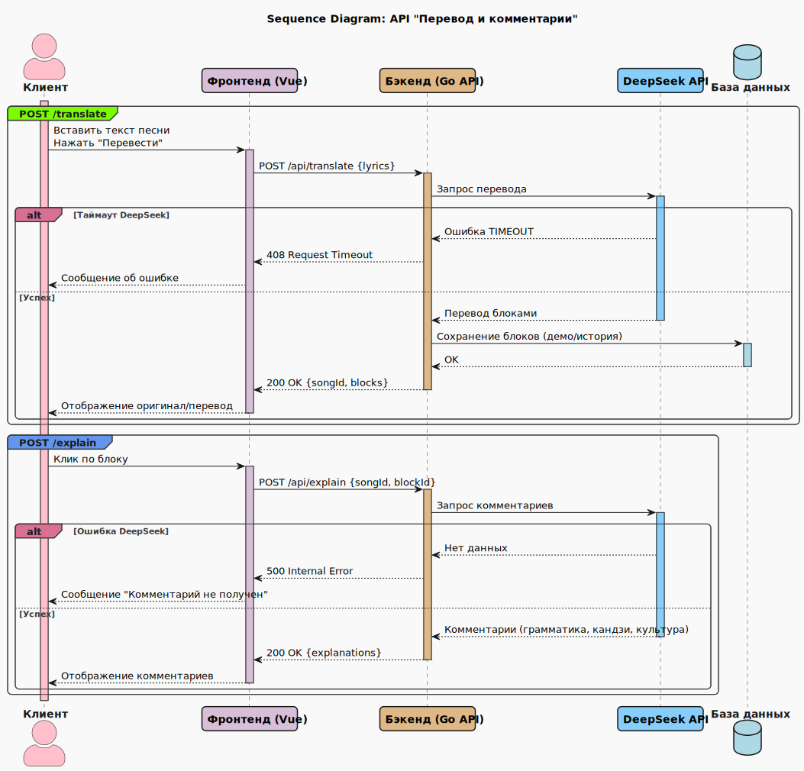
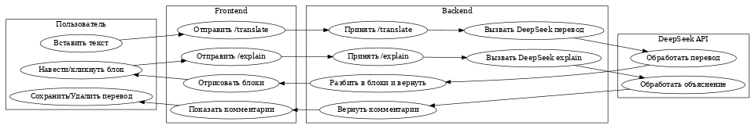

# Спецификация проекта jp-song-trainer

**Продукт:** Web‑приложение для изучения японского языка через разбор песен  
**Кодовое имя:** JP Songs -> RU Trainer  
**Методология:** Agile Scrum (итерации по 3 недели)  
**Инструменты:** Jira, Confluence, GitHub, Docker  
**Технологии (MVP):** Vue 3 (Vite, Pinia), Go (Fiber/Chi), SQLite (MVP) -> PostgreSQL (позже), OpenAPI, TailwindCSS  
**Интеграция ИИ:** DeepSeek (внешний API, модель заранее обучена)  
**Деплой (MVP):** локально, Docker; без облака  
**UI‑палитра:** `#a2d2ff #bee2ff #faaac7 #ffc8dd #cdb4db`

---

## 1. Видение и цели

**Видение:** дать изучающим японский "живой" контент (песни) с понятным переводом и дружелюбным разбором грамматики/кандзи/культуры.  
**Главная цель MVP:** быстро проверить ценность подхода на минимально полезной функциональности без регистрации.

**Бизнес‑цели:**

- Упростить понимание японских песен за счёт умного перевода и контекстных комментариев.
- Доказать жизнеспособность подхода (retention на примерах + пользовательские тексты).
- Подготовить основу для дальнейшей монетизации (донат "купите мне кофе").

**Ключевые KPI (MVP):**

- Время до первого полезного результата (TTFV) ≤ 20 сек от вставки текста до первого вывода.
- Доля пользователей, просмотревших ≥2 предзагруженные песни: ≥60%.
- Среднее количество взаимодействий с комментариями на сессию: ≥5.

---

## 2. Область охвата (Scope)

**В Scope (MVP):**

- Вставка пользователем текста песни вручную.
- Автоперевод (японский -> русский) с выравниванием по "блокам" (строки/фразы).
- Три панели UI: Оригинал / Перевод / Комментарии к выбранному блоку.
- Подсветка соответствующих блоков при наведении/клике.
- Генерация первичных комментариев (ИИ) + ручная правка комментариев.
- Сохранение результатов в "локальный кабинет" (без аккаунтов).
- Удаление сохранённых переводов с подтверждением.
- 3 предзагруженные демо‑песни.
- Роль Admin (локальная, через env/флаг) для правок демо‑материалов.

**Вне Scope (MVP):**

- Регистрация/аутентификация, соцлогины.
- Интеграции c YouTube/Spotify/лирическими сервисами.
- Совместная работа и комментарии других пользователей.
- Мобильные приложения (только адаптивная вёрстка).
- Платёжные системы (кроме ссылки на донат).

---

## 3. Стейкхолдеры и роли

- **User** — анонимный пользователь, использует переводчик, просматривает/правит комментарии локально, сохраняет/удаляет результаты.
- **Admin** — режим для владельца: может добавлять/редактировать демо‑песни, править глобальные комментарии, управлять метаданными.
- **Разработчик** — владелец репо, поддерживает код и инфраструктуру MVP.
- **DeepSeek** — внешний поставщик ИИ‑функций (перевод/объяснения).

---

## 4. Глоссарий

- **Блок** — минимальная единица выравнивания оригинала и перевода (обычно строка песни или фраза).
- **Комментарий** — объяснение грамматики, кандзи, культурных нюансов для конкретного блока.
- **Локальный кабинет** — список сохранённых пользователем результатов на данном устройстве/браузере (без аккаунта).

---

## 5. Допущения и ограничения

- Входной текст уже содержит японские символы; язык не авто‑определяется в MVP.
- Глубина аналитики ИИ зависит от качества DeepSeek; локальная валидация минимальна.
- Бесплатные технологии и локальный запуск; лимиты по стоимости API -> режим "дросселирования" запросов (rate limit).
- Ориентировочная одновременная нагрузка: до 10 активных пользователей/сессий.

---

## 6. Пользовательские истории (User Stories)

Полные описания пользовательских историй, включая Use Case-сценарии и Acceptance Criteria, вынесены в отдельный документ:  
[📄 User Stories и Use Cases](docs/user_stories.md)

**Список идентификаторов:**

- [US-1.1] Перевод текста песни
- [US-1.2] Подсветка соответствующих блоков
- [US-1.3] Получение комментариев к блоку
- [US-1.4] Сохранение результата анализа
- [US-1.5] Удаление сохранённого перевода
- [US-1.6] Редактирование комментариев (Admin)
- [US-1.7] Просмотр демо-песен

---

## 7. Функциональные требования

1. Вставка текста: большое поле ввода, кнопка "Начать перевод".
2. Обработка: отправка на backend -> DeepSeek -> возврат выровненных блоков и комментариев.
3. Три панели интерфейса; адаптивная вёрстка.
4. Подсветка соответствий (hover/click) с плавной анимацией.
5. Правка комментариев: режим редактирования для Admin; для User — локальные правки в сессии (не глобальные).
6. Сохранение: название перевода (авто‑по первой строке или ручной ввод), дата, артист/теги (опционально).
7. Удаление с подтверждением.
8. Предзагруженные 3 песни (seed‑данные) с подготовленными блоками и комментариями.
9. Донат: ссылка/кнопка "Buy me a coffee" (внешняя страница).

---

## 8. Нефункциональные требования

- **Производительность:** генерация первого блока ≤ 20 сек; следующая отрисовка инкрементальная (streaming).
- **Надёжность:** graceful‑handling ошибок DeepSeek; ретраи на таймаутах (экспоненциальная пауза, 2 попытки).
- **Юзабилити:** "уютная" палитра; понятная типографика; доступность (ARIA‑атрибуты, фокус‑стили).
- **Безопасность:** rate‑limit по IP/браузеру; сервер не хранит PII; CORS только для фронтенда.
- **Хранение:** SQLite (файл) для демо‑песен/метаданных; пользовательские сохранения — в IndexedDB (по умолчанию) + экспорт/импорт JSON.
- **Масштабирование (позже):** миграция на PostgreSQL и облако.

---

## 9. UX/UI принципы (MVP)

- Три колонки (desktop ≥1024px), на mobile — вертикальные секции.
- Hover‑подсветка "оригинал↔перевод"; клик — фиксирует выбор для панели "Комментарии".
- Комментарии структурировать: блоки "Грамматика", "Кандзи", "Культура", мини‑таблицы, эмодзи‑иконки.
- Тон интерфейса: дружелюбный, без перегруза терминами.
- Цвета и тени мягкие; фокус‑кольца видимые.

---

## 10. Архитектура решения

**Frontend (Vue 3):** Vite + TypeScript, Pinia (state), Vue Router, TailwindCSS.  
**Backend (Go):** Chi/Fiber, OpenAPI, модульная структура (handlers/service/repo), http client для DeepSeek, graceful shutdown.  
**Data:**

- SQLite для демо‑песен и глобальных комментариев (таблицы ниже).
- IndexedDB/LocalStorage для "моих переводов" на устройстве.

**Взаимодействие:**

1. FE отправляет `/api/translate` (тело: сырой текст).
2. BE стримит результат блоками (SSE/WebSocket или chunked HTTP).
3. FE выравнивает и отображает; по клику FE запрашивает/генерирует комментарии для блока `/api/explain`.



---

## 11. API (MVP Overview)

Полное описание REST API в формате OpenAPI размещено в отдельном файле:  
[📄 Swagger (OpenAPI)](docs/api/swagger.yaml)

### Основные эндпоинты

| Метод  | Endpoint                              | Назначение                                                  |
| ------ | ------------------------------------- | ----------------------------------------------------------- |
| POST   | `/api/translate`                      | Перевод текста песни (японский -> русский) блоками           |
| POST   | `/api/explain` _(план)_               | Получение комментариев (грамматика/кандзи/культура) к блоку |
| GET    | `/api/history`                        | Получить список сохранённых переводов                       |
| DELETE | `/api/history/{id}`                   | Удалить перевод из истории                                  |
| PUT    | `/api/comments/{id}`                  | Обновить комментарий к переводу                             |
| GET    | `/api/demo-songs` _(план)_            | Список демо-песен (метаданные + превью)                     |
| GET    | `/api/demo-songs/{id}` _(план)_       | Полные данные демо-песни                                    |
| PUT    | `/api/admin/demo-songs/{id}` _(план)_ | Редактирование демо-песни и комментариев (режим Admin)      |

### Общие правила

- **Формат запросов/ответов:** JSON
- **Коды ошибок:**
  - `400 Bad Request` — некорректный ввод
  - `403 Forbidden` — нет прав (только для Admin)
  - `404 Not Found` — песня/блок отсутствует
  - `408 Request Timeout` — истекло время ожидания ответа от DeepSeek
  - `429 Too Many Requests` — превышен лимит запросов
  - `500 Internal Server Error` — ошибка сервера

### Пример (POST /api/translate)

**Request**

```json
{
  "title": "My Song",
  "artist": "Some Artist",
  "lyrics": "君の名は..."
}
```

**Response**

```json
{
  "songId": "serial",
  "blocks": [
    { "id": "b1", "orig": "君の名は", "trans": "Твоё имя" },
    { "id": "b2", "orig": "...", "trans": "..." }
  ]
}
```

---

## 12. Модель базы данных (ERD)

### Сущности

| Сущность         | Описание                     | Ключевые атрибуты                                                                                   |
| ---------------- | ---------------------------- | --------------------------------------------------------------------------------------------------- |
| **Song**         | Песня (оригинал, метаданные) | `song_id (PK)`, `title`, `artist`, `lyrics_original`, `created_at`, `updated_at`                    |
| **SongBlock**    | Блок песни (строфа/строка)   | `block_id (PK)`, `song_id (FK)`, `order_num`, `text_orig`, `text_trans`, `created_at`, `updated_at` |
| **BlockComment** | Комментарий к блоку перевода | `comment_id (PK)`, `block_id (FK)`, `grammar`, `kanji`, `culture`, `created_at`, `updated_at`       |
| **LocalSave**    | Локально сохранённый перевод | `save_id (PK)`, `title`, `artist`, `blocks`, `created_at`, `updated_at`                             |

### Связи

| Связь                      | Кардинальность           | Описание                                                                                                         |
| -------------------------- | ------------------------ | ---------------------------------------------------------------------------------------------------------------- |
| `Song -> SongBlock`         | **1..N**                 | Один `Song` включает несколько `SongBlock`. Каждый блок принадлежит ровно одной песне.                           |
| `SongBlock -> BlockComment` | **0..N**                 | Один `SongBlock` может иметь ноль или более `BlockComment`. Каждый комментарий связан с одним блоком.            |
| `Song -> LocalSave`         | **0..N** _(опционально)_ | Один `Song` может быть сохранён локально несколько раз. Один `LocalSave` может ссылаться максимум на одну песню. |


---

## 13. Алгоритмы и потоки (BPMN-нотация)

1. **Пользователь вставляет текст** -> FE POST `/api/translate`.
2. **BE** валидирует вход -> вызывает DeepSeek -> получает перевод -> сегментирует в блоки -> возвращает поток блоков.
3. **FE** отрисовывает блоки; пользователь кликает блок.
4. FE POST `/api/explain` для блока -> BE вызывает DeepSeek "explain" -> возвращает структурированные пояснения.
5. Пользователь сохраняет результат -> запись в IndexedDB (и/или `local_saves` на сервере).
6. Удаление сохранения -> модальное подтверждение -> удаление.



---

## 14. Ошибки и обработка исключений

- **DeepSeek timeout** -> показать баннер с предложением повторить; BE делает 2 ретрая.
- **Неверный вход** -> подсветка поля, сообщение "Не похоже на японский текст" (только хинт, проверка мягкая).
- **Пустой ответ ИИ** -> показать заглушку и кнопку "Повторить попытку".

---

## 15. Безопасность и приватность

- Без аккаунтов -> минимум PII.
- API ключ DeepSeek хранится на сервере; на клиент не утекать.
- Rate limiting на `/api/*` (например, 30 req/мин/Origin/IP).
- CORS — только для фронтенда.

---

## 16. Тестирование (MVP)

- **Юнит‑тесты (Go):** сервисы перевода/объяснений (моки клиента DeepSeek), парсинг блоков.
- **Юнит‑тесты (Vue):** рендер колонок, подсветка соответствий, состояние Pinia.
- **Интеграционные:** энд‑ту‑энд сценарий "вставка->перевод->комментарии->сохранение->удаление" (Playwright).
- **Нагрузочные (минимум):** имитация 10 одновременных переводов (k6/vegeta).

---

## 17. Планы релизов и дорожная карта (3 недели)

**Спринт‑MVP (3 недели):**

- Бэкенд: маршруты `/translate`, `/explain`, `/demo-songs/*`; клиент DeepSeek; стриминг.
- Фронтенд: три панели, подсветка, список "Мои переводы", модал удаления.
- Демо‑данные: 3 песни, разметка блоков, первичные комментарии.
- Тесты: юнит + сквозной.
- Документация: Confluence (структура ниже), OpenAPI.

**Следующие итерации:**

- Импорт/экспорт сохранений (JSON файл).
- Словарные всплывашки по клику на кандзи.
- Лёгкая авторизация (гость->аккаунт) и синхронизация сохранений.

---

## 18. Риски и меры

- **Нестабильность DeepSeek** -> кэширование последних ответов, повторная отправка, offline‑заглушки для демо‑песен.
- **Лимиты по бюджету** -> дросселирование, кап на длину текста, локальная обработка для демо‑режима.
- **Качество разметки блоков** -> эвристики + ручная правка админа для демо‑песен.

---

## 19. Definition of Ready / Done

**DoR:** история имеет цель, AC, макет UI, пример входа/выхода ИИ.  
**DoD:** код покрыт тестами, проверен линтером, обновлена документация, пройден E2E.

---

## 20. Структура документации (Confluence) и связи

**Пространство "JP Songs"**

1. **Product Vision & Strategy**  
   ↳ Ссылается на: KPI, целевая аудитория.
2. **MVP Specification** _(этот документ)_  
   ↳ Ссылается на: API Spec, ERD, UX Guidelines.
3. **Architecture Overview**  
   ↳ Диаграммы: контекст (C4 Level 1), контейнеры (C4 L2), последовательности; ссылка на репо.
4. **API Specification (OpenAPI)**  
   ↳ Подключено к автогенерации клиента/серверов.
5. **Data Model & ERD**  
   ↳ Таблицы, миграции, политики хранения.
6. **BPMN: Flows**  
   ↳ Основные пользовательские сценарии как процессы.
7. **UX/UI Guidelines**  
   ↳ Палитра, компоненты, примеры экранов, доступность.
8. **Testing Strategy**  
   ↳ Юнит/интеграция/E2E, тест‑данные, отчётность.
9. **Runbook (Dev & Ops)**  
   ↳ Локальный запуск (Docker), переменные окружения, отладка, троттлинг.
10. **Roadmap & Release Notes**  
    ↳ План итераций, заметки релизов.

**Связи:**

- _MVP Specification_ ↔ _API Spec_ (синхронизация моделей и контрактов).
- _Data Model & ERD_ ↔ _Architecture_ (источник правды по сущностям).
- _UX Guidelines_ ↔ _MVP Spec_ (AC по UI).
- _Testing Strategy_ ↔ все разделы (истории -> тест‑кейсы -> отчёты).

---

## 21. Бэклог (Jira) — эпики и ключевые задачи

**EPIC‑FE‑MVP: UI/UX**

- FE‑1: Шаблон Vue + Tailwind + Router + Pinia.
- FE‑2: Экран "Анализ песни" (3 панели, подсветка).
- FE‑3: "Мои переводы" (IndexedDB), карточки/список.
- FE‑4: Модал подтверждения удаления.
- FE‑5: Страница демо‑песен (3 шт.).

**EPIC‑BE‑MVP: API & DeepSeek**

- BE‑1: Контракт OpenAPI.
- BE‑2: `/translate` (стриминг блоков).
- BE‑3: `/explain` (структурированные пояснения).
- BE‑4: `/demo-songs/*` CRUD (Admin для правок).
- BE‑5: Rate‑limit, логирование, обработка ошибок.

**EPIC‑DATA‑MVP: Модель и миграции**

- DATA‑1: SQLite схема, миграции.
- DATA‑2: Seed 3 песен.
- DATA‑3: Скрипт экспорта/импорта JSON.

**EPIC‑QA‑MVP: Тестирование**

- QA‑1: Юнит (Go/Vue).
- QA‑2: E2E (Playwright).
- QA‑3: Нагрузочные (k6/vegeta).

---

## 22. Переменные окружения (пример)

- `DEEPEEK_API_KEY` — ключ доступа.
- `DEEPEEK_BASE_URL` — адрес API.
- `APP_ADMIN_MODE=true|false` — режим админа.
- `RATE_LIMIT=30/m` — лимит запросов.

---

## 23. Критерии приёмки MVP

- Возможность перевести пользовательский текст и увидеть выровненные блоки.
- Комментарии генерируются и отображаются; админ может править демо‑комментарии.
- Список "Мои переводы" работает локально; удаление — с подтверждением.
- 3 предзагруженные песни доступны из меню демо.
- Покрытие тестами (минимум): 60% критической логики BE, E2E сценарий зелёный.

---

## 24. Приложения

- **Черновик OpenAPI (yaml)** — в отдельной странице.
- **ERD** и **Sequence Diagram** — встроены в документ; исходники в папке docs/diagrams.